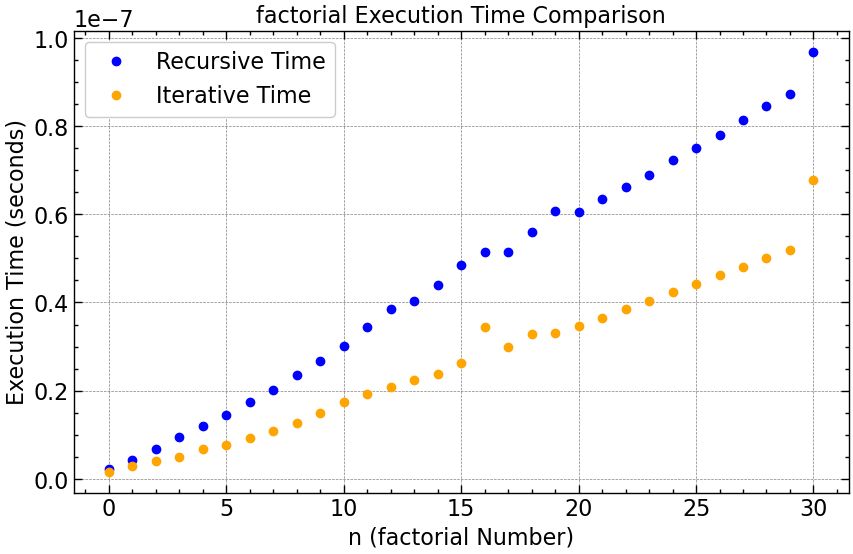

# Análise de Desempenho: Fatorial Recursivo vs. Iterativo

Este projeto realiza uma análise comparativa do desempenho de duas implementações para o cálculo do fatorial: uma abordagem **recursiva** e uma **iterativa**. A análise é feita medindo o tempo de execução de cada algoritmo para uma gama de valores de entrada `n`, gerando dados brutos em um arquivo `.csv` e, em seguida, visualizando esses dados em gráficos.

## Implementação

O projeto é dividido em duas partes principais: um programa em C para a lógica dos algoritmos e a medição de tempo, e um script em Python para a visualização dos dados.

### **1. Lógica dos Algoritmos e Coleta de Dados (C)**

O código-fonte em C é responsável por:

1.  **Implementar as duas versões da função Fatorial:**

      * `factorial_recursive`: Segue a definição matemática clássica $n\! = n \\times (n-1)\!$. Para cada chamada, a função chama a si mesma uma vez até atingir o caso base ($n=0$). Isso gera uma pilha de `n` chamadas, resultando em uma complexidade de tempo linear, $O(n)$.

      * `factorial_iterative`: Utiliza um laço (`for`) que se repete `n` vezes para calcular o resultado. Como o laço tem `n` repetições, a complexidade de tempo também é linear, $O(n)$.

2.  **Medir o Tempo de Execução:**

      * As funções `calculate_recursive_time` e `calculate_iterative_time` usam a função `clock()` da biblioteca `<time.h>` para medir o tempo de processador gasto.
      * Para obter uma medição mais estável, cada função é executada um grande número de vezes (`RECURSIVE_REPEATS` e `ITERATIVE_REPEATS`), e o tempo médio por execução é calculado.

3.  **Gerar Dados para Análise:**

      * A função `data_generate()` itera sobre valores de `n` (de 0 a `N_MAX`), chama as funções de medição de tempo para ambas as implementações e escreve os resultados (`n`, `tempo_recursivo`, `tempo_iterativo`) em um arquivo chamado `data.csv`.

### **2. Geração e Visualização de Gráficos (Python)**

O script `graph.py` (não fornecido, mas assumido do projeto anterior) utiliza as seguintes bibliotecas:

  * **Pandas:** Para ler e manipular os dados do arquivo `data.csv` de forma eficiente.
  * **Matplotlib** e **SciencePlots:** Para criar gráficos de alta qualidade e com estilo científico.

O script deve gerar gráficos que permitam comparar visualmente o tempo de execução das duas abordagens.

## Resultados e Análise Esperados

Ao contrário do Fibonacci recursivo, cuja complexidade é exponencial ($O(2^n)$), o fatorial recursivo tem complexidade linear ($O(n)$), assim como sua versão iterativa. Portanto, esperamos resultados diferentes aqui.

Uma informação importante a se considerar é que o `unsigned int` tem capacidade de armazenar apenas 32 bits, o que nos permite calcular até o 12! utilizando o algorítmo.
Levando isso em conta, os valores de variação de tempo ainda são válidos, entretanto,  os resultados dos calculos podem (e provavelmente estão) inconssistentes por conta de estouro de memória para fatoriais maiores que 12.

### **Tempo de Execução: Ambas as Versões**

  * Esperamos que o gráfico de tempo de execução para **ambas** as versões (recursiva e iterativa) se aproxime de uma **linha reta** quando plotado em escala linear. Isso confirma a complexidade $O(n)$ para os dois algoritmos.
  * Apesar de terem a mesma complexidade assintótica, é provável que a linha da versão **recursiva** seja ligeiramente mais inclinada (ou seja, com tempos maiores). Isso ocorre devido ao *overhead* (custo computacional adicional) da criação de novas chamadas de função e gerenciamento da pilha de recursão, em comparação com um simples incremento em um laço `for`.
  * A versão **iterativa** deve se mostrar consistentemente mais rápida, embora a diferença seja em um fator constante, e não exponencial como no caso de Fibonacci.

### **Tempo de Execução: Versão Recursiva**

* A curva de tempo da versão iterativa se aproxima de uma **reta**, como esperado para $O(n)$ em escala linear

---

### **Tempo de Execução: Versão Iterativa**

* A curva de tempo da versão iterativa se aproxima de uma **reta**, como esperado para $O(n)$ em escala linear

---

### **Comparativo em Escala Linear**

* Fica evidente, que, para o problema em questão, a versão iterativa é mais rápida.

---

## Conclusão

Os dados e gráficos gerados devem confirmar que ambas as implementações do fatorial possuem uma complexidade de tempo linear, $O(n)$. A análise mostrará que, embora teoricamente equivalentes em termos de complexidade, a abordagem **iterativa é mais eficiente na prática** devido ao menor custo computacional em comparação com as chamadas de função recursivas.

A escolha entre uma e outra em um projeto real pode depender do contexto: a recursiva pode ser considerada mais elegante e próxima da definição matemática, enquanto a iterativa oferece melhor desempenho bruto.

