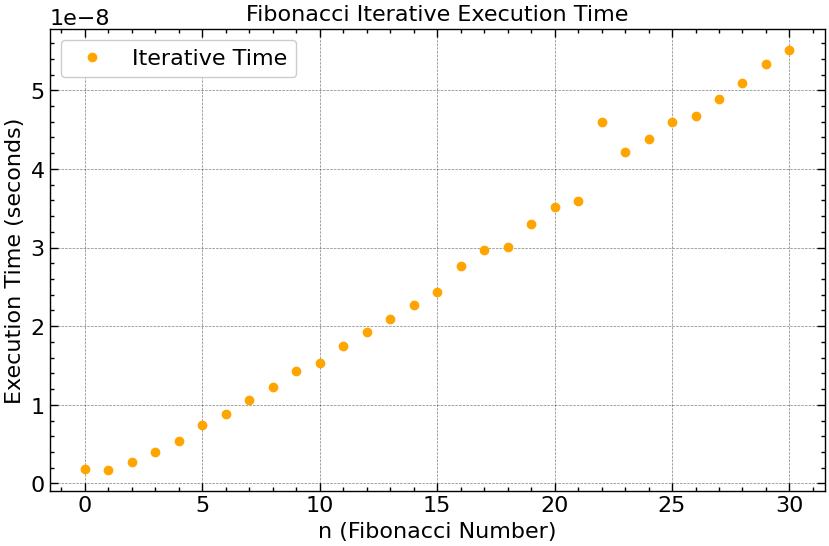

# Análise de Desempenho: Fibonacci Recursivo vs. Iterativo

Este projeto realiza uma análise comparativa do desempenho de duas implementações para o cálculo da sequência de Fibonacci: uma abordagem **recursiva** e uma **iterativa**. A análise é feita medindo o tempo de execução de cada algoritmo para uma gama de valores de entrada `n`, gerando dados brutos em um arquivo `.csv` e, em seguida, visualizando esses dados em gráficos para uma interpretação clara da diferença de eficiência.

## Implementação

O projeto é dividido em duas partes principais: um programa em C para a lógica dos algoritmos e a medição de tempo, e um script em Python para a visualização dos dados.

### **1. Lógica dos Algoritmos e Coleta de Dados (C)**

O código-fonte em C é responsável por:
1.  **Implementar as duas versões da função Fibonacci:**
    * `fibonacci_recursive`: Segue a definição matemática clássica $F(n) = F(n-1) + F(n-2)$. É uma implementação elegante, porém ineficiente, pois recalcula os mesmos valores múltiplas vezes, gerando uma árvore de chamadas redundante.
    * `fibonacci_iterative`: Utiliza um laço `for` para calcular os valores da sequência de forma linear, armazenando apenas os dois últimos valores necessários. Esta abordagem evita a redundância e é significativamente mais eficiente.

2.  **Medir o Tempo de Execução:**
    * As funções `calculate_recursive_time` e `calculate_iterative_time` usam a função `clock()` da biblioteca `<time.h>` para medir o tempo de processador gasto.
    * Para obter uma medição mais estável, cada função é executada um grande número de vezes (`RECURSIVE_REPEATS` e `ITERATIVE_REPEATS`), e o tempo médio por execução é calculado.

3.  **Gerar Dados para Análise:**
    * A função `data_generate()` itera sobre valores de `n` (de 0 a `N_MAX`), chama as funções de medição de tempo para ambas as implementações e escreve os resultados (`n`, `tempo_recursivo`, `tempo_iterativo`) em um arquivo chamado `data.csv`.

### **2. Geração e Visualização de Gráficos (Python)**

O script `graph.py` utiliza as seguintes bibliotecas:
* **Pandas:** Para ler e manipular os dados do arquivo `data.csv` de forma eficiente.
* **Matplotlib** e **SciencePlots:** Para criar gráficos de alta qualidade e com estilo científico.

O script gera quatro gráficos distintos para analisar os dados sob diferentes perspectivas.

## Resultados e Análise

A execução do código em C gera os dados de tempo, e o script em Python produz os seguintes gráficos.

### **Tempo de Execução: Versão Recursiva**

Este gráfico mostra o tempo de execução apenas da função recursiva. É visível um crescimento **exponencial**. Para valores pequenos de `n` (até ~35), o tempo é baixo, mas ele dispara rapidamente, tornando a função impraticável para valores maiores.

A complexidade de tempo desta abordagem é da ordem de $O(\phi^n)$, onde $\phi \approx 1.618$ (a Razão Áurea), o que confirma o comportamento observado.

---

### **Tempo de Execução: Versão Iterativa**

O gráfico da versão iterativa mostra um crescimento **linear** e quase imperceptível em comparação com a escala de tempo da versão recursiva. O tempo de execução aumenta de forma proporcional e previsível com o aumento de `n`.

A complexidade de tempo é $O(n)$, pois o laço executa `n` vezes. Isso a torna uma solução extremamente eficiente e escalável.

---

### **Comparativo em Escala Linear**

Ao plotar ambos os resultados no mesmo gráfico com escala linear, a diferença de desempenho se torna brutalmente clara. A curva da versão iterativa fica "esmagada" contra o eixo X, parecendo ser zero, enquanto a curva recursiva sobe de forma vertiginosa.

Este gráfico ilustra perfeitamente por que algoritmos de complexidade exponencial são inviáveis para conjuntos de dados que não sejam muito pequenos.

---

### **Comparativo em Escala Logarítmica**

Para visualizar melhor o comportamento de ambas as curvas no mesmo gráfico, utilizamos uma **escala logarítmica** no eixo Y (tempo). Isso nos permite comparar ordens de magnitude.

Nesta visualização:
* A curva de tempo da versão recursiva (crescimento exponencial) se aproxima de uma **linha reta**, o que é uma característica de funções exponenciais em gráficos semi-log.
* A curva da versão iterativa (crescimento linear) permanece visível na parte inferior, mostrando seu crescimento muito mais contido.

## Conclusão

A análise confirma que, embora a solução recursiva para Fibonacci seja mais direta de escrever a partir da definição matemática, sua complexidade exponencial ($O(\phi^n)$) a torna computacionalmente cara e inadequada para uso prático. Em contraste, a solução **iterativa**, com sua complexidade linear ($O(n)$), é drasticamente mais eficiente, escalável e a escolha correta para este problema.

Este projeto serve como um excelente exemplo prático do impacto que a escolha do algoritmo e a análise de complexidade têm no desempenho de um software.